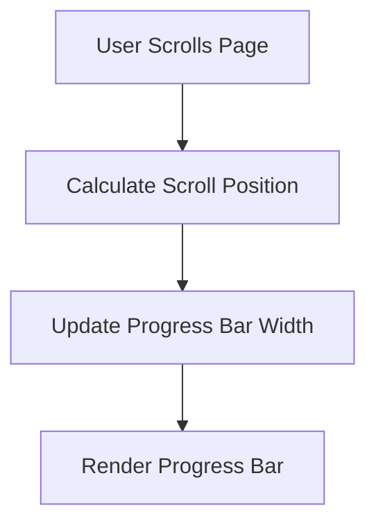
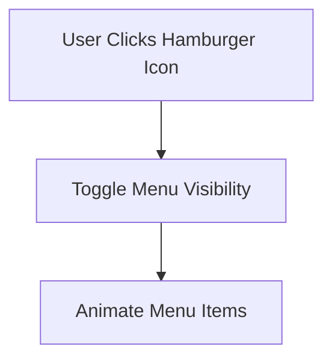
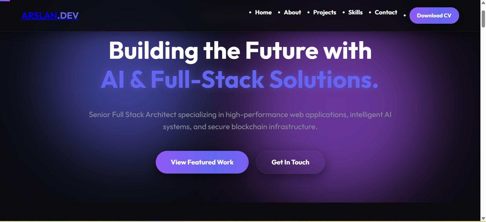
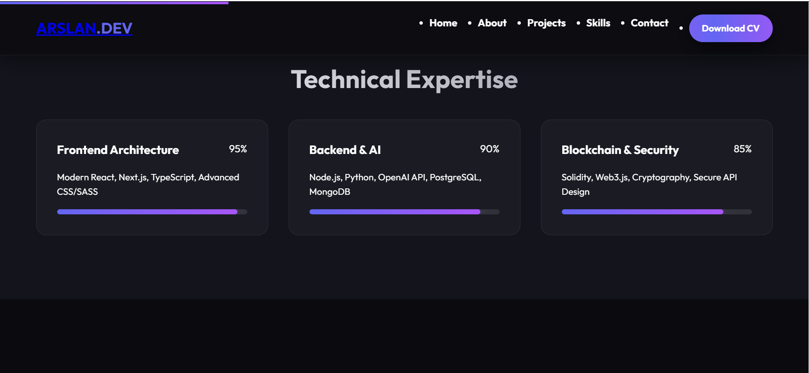
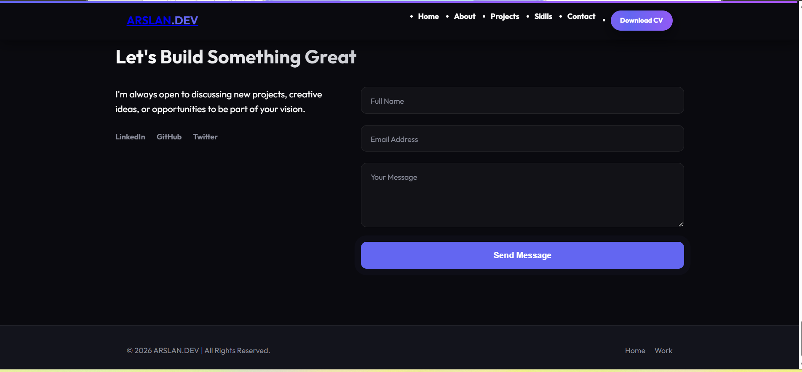

# Personal Portfolio Project

Welcome to the **Personal Portfolio Project**! This repository showcases a professional portfolio for a Full Stack Developer specializing in AI-powered solutions, blockchain applications, and scalable systems. The portfolio is designed to highlight skills, projects, and expertise in a visually appealing and interactive manner.

## Table of Contents
- [Features](#features)
- [Technologies Used](#technologies-used)
- [Getting Started](#getting-started)
- [Project Structure](#project-structure)
- [Workflow Diagrams](#workflow-diagrams)
- [License](#license)
- [Screenshots](#screenshots)

---

## Features
- **Responsive Design**: Fully optimized for desktop and mobile devices.
- **Interactive Animations**: Smooth scroll animations and progress indicators.
- **Customizable Themes**: Easily update colors and styles via CSS variables.
- **Downloadable CV**: Quick access to a downloadable resume.
- **Modern Navigation**: Mobile-friendly hamburger menu.

---

## Technologies Used
- **HTML5**: Semantic structure and accessibility.
- **CSS3**: Modern styling with variables and animations.
- **JavaScript (Vanilla)**: Interactivity and animations.
- **Google Fonts**: Custom typography.

---

## Getting Started

### Prerequisites
Ensure you have the following installed:
- A modern web browser (e.g., Chrome, Firefox, Edge).

### Installation
1. Clone the repository:
   ```bash
   git clone https://github.com/your-username/Personal-Portfolio-project-1-.git
   ```
2. Navigate to the project directory:
   ```bash
   cd Personal-Portfolio-project-1-
   ```
3. Open `index.html` in your browser to view the portfolio.

---

## Project Structure
```
Personal-Portfolio-project-1-
├── index.html    # Main HTML file
├── style.css     # Stylesheet for the portfolio
├── script.js     # JavaScript for interactivity
```

---

## Workflow Diagrams

### Scroll Progress Workflow


### Mobile Menu Workflow


---

## License
This project is licensed under the MIT License. See the [LICENSE](LICENSE) file for details.

---

## Author
**Arslan**  
Full Stack Architect & AI Specialist  
[Portfolio](https://arslan.dev) | [LinkedIn](https://linkedin.com/in/arslan) | [GitHub](https://github.com/your-username)

## Screenshots

Here are some screenshots of the portfolio:

### Landing Page


### About Section


### Skills Section


### Projects Section


### Contact Section


---